# 🔵 SIEM Solution Deployment & Security Event Analysis


> Deployed a full enterprise-grade SIEM environment using Wazuh, Elastic Stack,
> and Kibana across multiple endpoints. Performed real-time security event analysis,
> vulnerability detection, threat hunting, and MITRE ATT&CK mapping.

---

## 📋 Project Overview

| Detail | Info |
|---|---|
| **Duration** | April 3 – April 20, 2026 |
| **Platform** | VMware Virtualized Environment |
| **SIEM Tool** | Wazuh v4.11.2 |
| **Endpoints Monitored** | 2 (Kali Linux + Windows 11) |
| **Total Events Analyzed** | 1,304+ security events |
| **Vulnerabilities Detected** | 69 (1 Critical, 31 High, 37 Medium) |

---

## 📁 Repository Structure

```
SIEM-Deployment/
└── screenshots/
    ├── network-diagram.jpg
    ├── wazuh-dashboard.jpg
    ├── agent-deployment-linux.jpg
    ├── agent-installation-kali.jpg
    ├── agent-active-kali.jpg
    ├── agent-deployment-windows.jpg
    ├── endpoints.jpg
    ├── endpoints-both.jpg
    ├── mitre-attck.jpg
    ├── mitre-attck-dashboard.jpg
    ├── mitre-attck-framework.jpg
    ├── mitre-attck-intelligence.jpg
    ├── vulnerability-detection.jpg
    ├── threat-hunting.jpg
    └── file-integrity.jpg
```

---

## 🏗️ Network Architecture

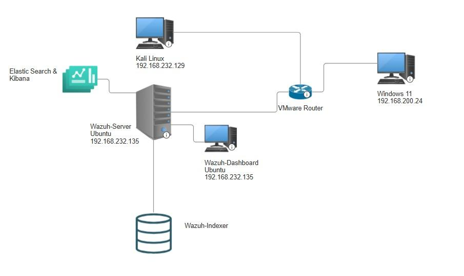

| Component | OS | IP Address | Role |
|---|---|---|---|
| Wazuh Server | Ubuntu | 192.168.232.135 | SIEM Core + Indexer |
| Wazuh Dashboard | Ubuntu | 192.168.232.135 | Web UI |
| Elastic Search + Kibana | — | — | Log Storage + Visualization |
| Kali Linux | Kali 2025.1 | 192.168.232.129 | Monitored Endpoint |
| Windows 11 | Win 11 Home | 192.168.200.24 | Monitored Endpoint |
| VMware Router | — | — | Network Gateway |

---

## 🛠️ Tools & Technologies

| Tool | Purpose | Version |
|---|---|---|
| **Wazuh** | SIEM & XDR Platform | v4.11.2 |
| **Elastic Stack** | Log Storage & Indexing | Active |
| **Kibana** | Data Visualization | Active |
| **Kali Linux** | Endpoint Agent (Linux) | 2025.1 |
| **Windows 11** | Endpoint Agent (Windows) | 10.0.26100 |
| **VMware** | Virtualization Platform | — |

---

## 📊 Wazuh Dashboard Overview

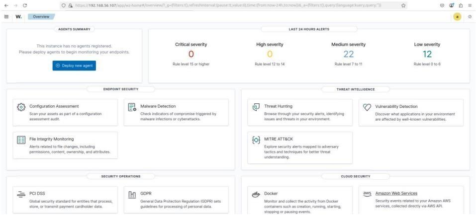

### Last 24 Hours Alerts

| Severity | Count | Rule Level |
|---|---|---|
| 🔴 Critical | 0 | Level 15 or higher |
| 🟠 High | 0 | Level 12 to 14 |
| 🟡 Medium | 22 | Level 7 to 11 |
| 🟢 Low | 12 | Level 0 to 6 |

### Security Modules Active
- ✅ Configuration Assessment
- ✅ Malware Detection
- ✅ File Integrity Monitoring
- ✅ Threat Hunting
- ✅ Vulnerability Detection
- ✅ MITRE ATT&CK

---

## 📡 Agent Deployment

### Step 1 — Deploy Agent on Kali Linux

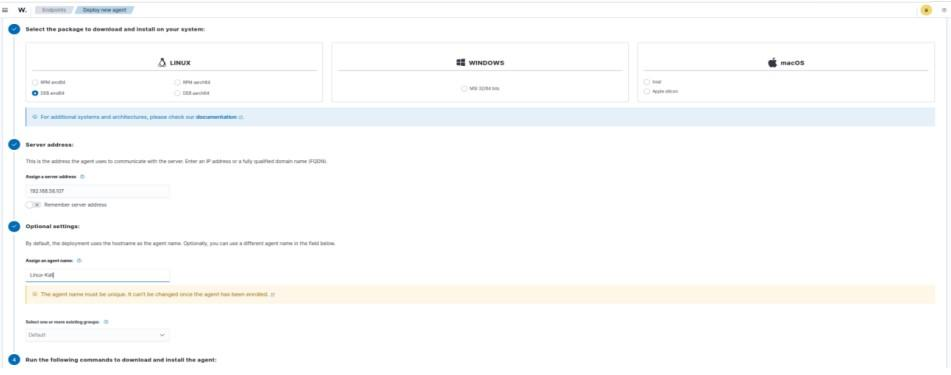

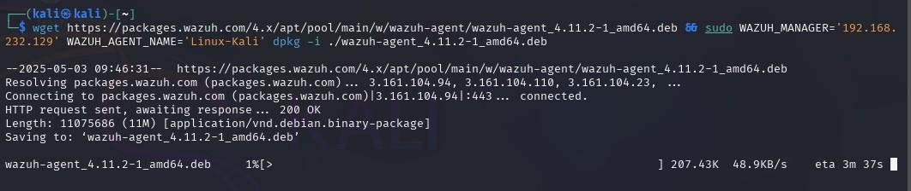

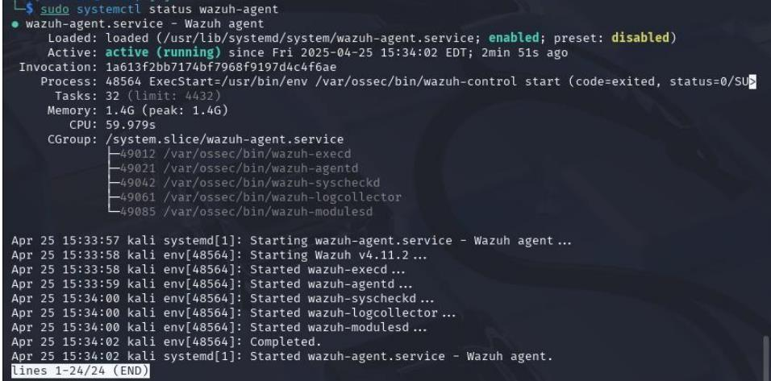

### Step 2 — Deploy Agent on Windows 11

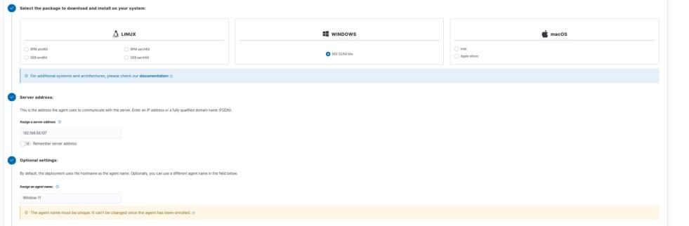

### Step 3 — Verify All Endpoints Connected

**First Agent Connected — Kali Linux:**

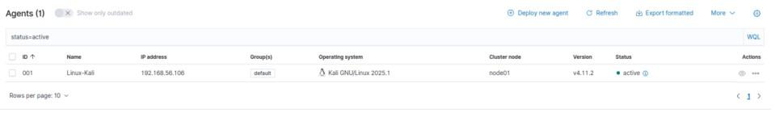

**Both Agents Active:**

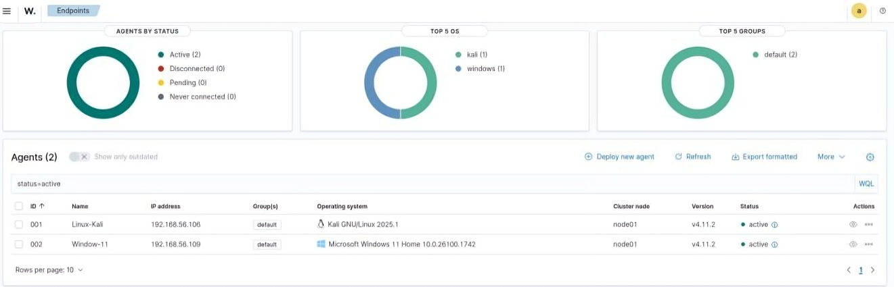

| ID | Agent Name | IP Address | OS | Version | Status |
|---|---|---|---|---|---|
| 001 | Linux-Kali | 192.168.56.106 | Kali GNU/Linux 2025.1 | v4.11.2 | 🟢 Active |
| 002 | Window-11 | 192.168.56.109 | Windows 11 Home 10.0.26100 | v4.11.2 | 🟢 Active |

---

## 🎯 MITRE ATT&CK Analysis

### Dashboard Overview
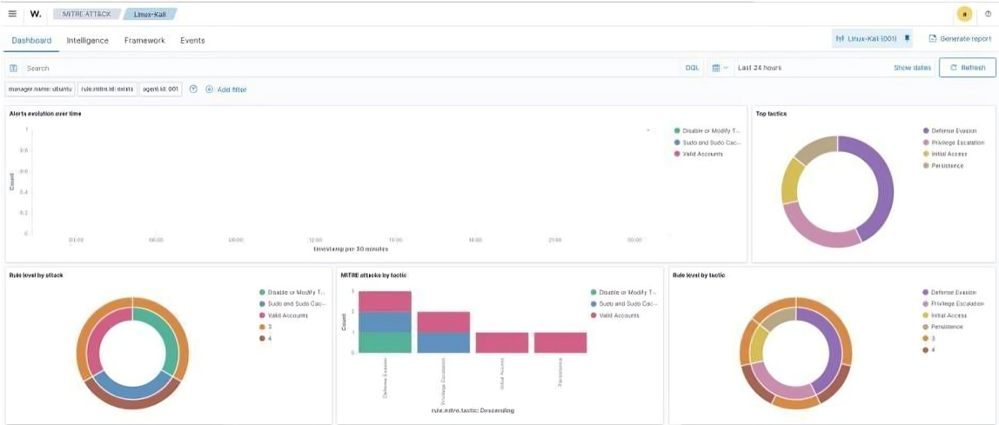

### Tactics Detected on Kali Linux

| Tactic | Alerts | Technique |
|---|---|---|
| 🛡️ Defense Evasion | 3 | T1562.001 - Disable or Modify Tools |
| ⬆️ Privilege Escalation | 2 | T1548.003 - Sudo and Sudo Caching |
| 🔐 Persistence | Active | T1556.003 - Pluggable Authentication Modules |
| 🚪 Initial Access | 1 | T1078 - Valid Accounts |

### Framework — Tactics & Techniques
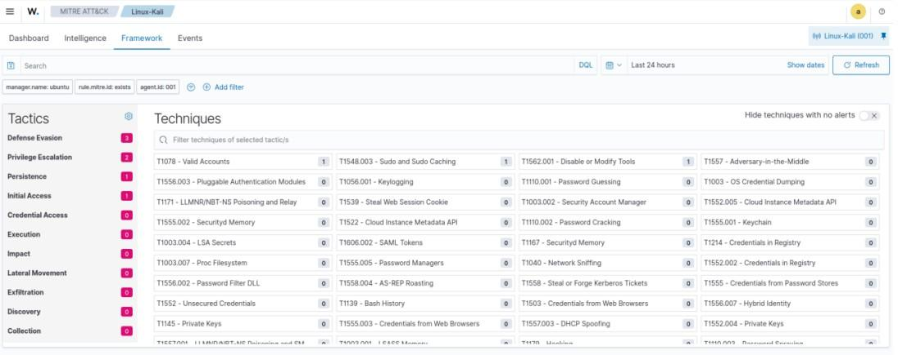

### Threat Intelligence — Groups Database
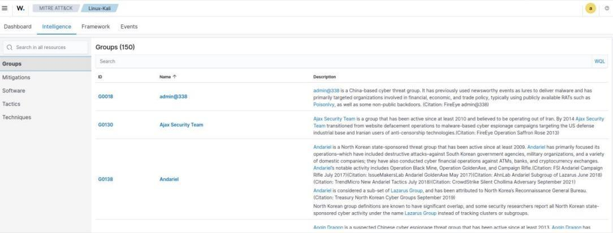

---

## 🦠 Vulnerability Detection (Windows 11)

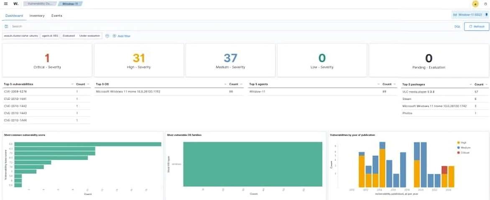

### Severity Summary

| Severity | Count |
|---|---|
| 🔴 Critical | 1 |
| 🟠 High | 31 |
| 🟡 Medium | 37 |
| 🟢 Low | 0 |
| **Total** | **69** |

### Top CVEs Detected

| CVE | Severity |
|---|---|
| CVE-2008-1178 | High |
| CVE-2010-1681 | High |
| CVE-2012-1442 | High |
| CVE-2012-1443 | High |
| CVE-2012-1664 | High |

### Most Vulnerable Packages

| Package | Vulnerabilities |
|---|---|
| VLC Media Player 3.0.8 | 57 |
| Steam | 8 |
| Microsoft Windows 11 Home | 3 |
| Photos | 1 |

---

## 🔎 Threat Hunting (Windows 11)

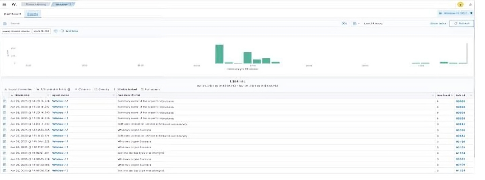

| Detail | Info |
|---|---|
| **Total Events** | 1,304 hits |
| **Event Types** | Windows Logon Success, Software Protection, Service Changes |

---

## 📁 File Integrity Monitoring (Kali Linux)

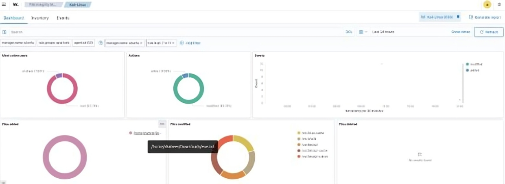

| Monitor | Status |
|---|---|
| Files Added | Tracked |
| Files Modified | Detected |
| Files Deleted | No results |
| Active Users | root 100% |

---

## 📚 Key Skills Demonstrated

- ✅ SIEM deployment and configuration in virtualized environment
- ✅ Multi-platform agent deployment (Linux + Windows)
- ✅ Real-time security event monitoring and alert triage
- ✅ MITRE ATT&CK framework mapping and threat classification
- ✅ Vulnerability assessment and CVE identification
- ✅ Threat hunting with 1,304+ security events analyzed
- ✅ File Integrity Monitoring (FIM) configuration
- ✅ Security log analysis and incident documentation

---

## 🎓 Learning Outcomes

Through this project I gained hands-on experience in:

- Configuring enterprise SIEM infrastructure from scratch
- Understanding how real attacks map to MITRE ATT&CK tactics
- Analyzing security events and distinguishing true positives from noise
- Identifying unpatched vulnerabilities using CVE databases
- Monitoring file system changes for threat detection
- Writing professional security incident documentation

---

## 📞 Contact

**Qammer Abbas**
📧 [qammer1122@gmail.com](https://mail.google.com/mail/?view=cm&fs=1&to=qammer1122@gmail.com)
🔗 [LinkedIn](https://linkedin.com/in/qammer1122)
🐙 [GitHub](https://github.com/qammer1122)
🛡️ [TryHackMe](https://tryhackme.com/p/qammer1122)
